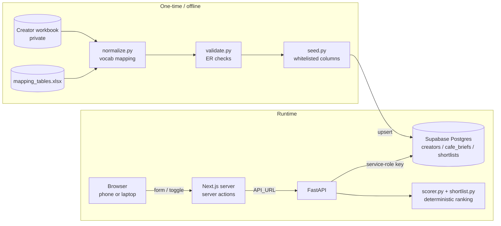

# Architecture

## Principles

1. **Deterministic ranking.** Scoring and ranking are plain Python arithmetic over fixed rules. Same input → same output, verified by tests (including shuffled input order). There is no LLM anywhere in the ranking path.
2. **LLMs only classify, never score.** Free-text enrichment (content category, tone, production style…) is mapped onto a fixed vocabulary by a lookup table, not by a model at runtime. Unknown values are flagged `UNMAPPED`, never guessed.
3. **Show uncertainty.** Every creator carries a location tier (measured vs inferred) and an engagement confidence (cross-checked vs not). The UI is designed around these labels.
4. **Never silently change data.** Data fixes follow written rules, are logged per creator, and are skipped (flagged for review) whenever the evidence is insufficient.
5. **Secrets and personal data stay server-side.** The browser never reaches FastAPI or Supabase directly; contact details never reach the database.

## System overview



| Component | Hosting | Holds secrets? |
|---|---|---|
| Next.js frontend (`web/`) | Vercel | `API_URL` only (not a secret, but server-only) |
| FastAPI (`api.py`) | Render (`render.yaml`) | Supabase service-role key |
| Supabase | Supabase cloud | — (row-level security on, no public policies) |

## Data pipeline

### Phase 1: Normalization (`normalize.py`)
Creator fields arrive as free text from enrichment (e.g. "Aspirational / Aesthetic"). `data/mapping_tables.xlsx` maps each raw value to the fixed **Lists** vocabulary, one tab per column. Rules:
- Exact match after trimming; no fuzzy matching.
- An unmapped value becomes `UNMAPPED` and is logged; a mapping target outside the vocabulary fails loudly at load time.
- "Regularly features Pune venues?" keeps three levels (Yes / Occasionally / No) so occasional featuring earns partial credit.

### Phase 3: Engagement-rate validation (`validate.py`)
Stored `ER%` should equal `engagements ÷ followers` (same scrape). Where they disagree by more than 25%, neither column is trusted wholesale; **avg likes + comments** arbitrate, but only if they are themselves consistent with reel plays (0.2%–20% of plays).

| Case | Action |
|---|---|
| Likes+comments back `engagements ÷ followers` | **corrected** to that value |
| Likes+comments back stored ER | **kept** |
| No arbiter, stored ER > 100% or > 10× the recompute | **corrected** (clear outlier) |
| Stored ER = 0 but engagements > 0 | **filled** ("not captured") |
| Anything else unresolved | **flagged** for manual review, value unchanged |

Flagged creators are still scored, but carry `engagement_confidence: "unverified"`. If a flagged value is also implausible, its engagement is capped at the pool median so it cannot ride into the top ranks.

### Seeding (`seed.py`)
Runs normalization + validation, then upserts creators into Supabase using a **column whitelist** (`db.CREATOR_FIELDS`). Email, phone and address can never be sent — a test plants fake PII and proves it does not leave the machine. Seeding also exports the vocabulary to `data/vocab.json`, so the deployed API never needs the workbook.

## Scoring model (`scorer.py`, levers in `config.py`)

```
final = 0.50 × location + 0.30 × content + 0.20 × engagement      (shown ×100)
```

**Location fit, in tiers**

| Tier | Signal | Score range |
|---|---|---|
| Verified | Share of the creator's audience in the café's city (top-5 audience cities) | 0.60 – 1.00, scaled to the best verified creator |
| Proxy | Creator's own base location + how often they feature city venues (Yes 1, Occasionally 0.5, No 0) | 0 – 0.60, scaled to the best proxy creator |
| Unknown | Neither | 0 |

The bands guarantee an inferred location never outranks a measured one.

**Content match**: a 6×6 tone matrix (creator tone × café tone preference), e.g. an exact match is 1.0, Luxury vs Aesthetic/Calm 0.6.

**Engagement**: `0.6 × ER part + 0.4 × posting pace`. ER is scaled against the **95th percentile** of the pool (capped at 1), so one real 300% outlier keeps the top score without flattening everyone else. Posting pace: High 1.0, Moderate 0.8, Low 0.4, Inactive 0.1, Insufficient 0.

**Eligibility**: complete records only; accounts normalized to category "Other" (venues, off-domain) are excluded and logged.

**Ranking**: sort by final score, ties broken by handle, so output is stable.

## Requirements, filters and scope (`shortlist.py`, `api.py`)

- **Brief**: city and tone drive scoring. Budget drives only the optional filter. Name, area, objective, format, price bracket and vibe are context: stored and displayed, never used to rank.
- **Budget filter** (off by default): with "Paid Only" and a max spend, hides creators whose *lowest* estimated rate exceeds it. Rows are removed, never re-ordered or re-scored; hidden higher ranks are returned (`skipped_higher_ranked`) and stored with the shortlist.
- **Pune scope**: any city is accepted; non-Pune briefs return a "not supported yet" message and no list, because the pool's audience data would otherwise overstate relevance elsewhere.
- **Top N**: the API returns the top 5 after the filter (`top_n` to change).

## Data model (`schema.sql`)

| Table | Contents |
|---|---|
| `creators` | Normalized, validated creator fields the scorer needs (handle, tone, category, audience cities, ER, pace, confidence flags, estimated rate). No contact details. |
| `cafe_briefs` | One row per submitted brief (city, tone, budget, context fields) |
| `shortlists` | The generated result: ranked rows (JSON), skipped ranks, filter note, scope message; linked to its brief |

Row-level security is enabled with no policies: the public anon key can read nothing; only the backend's service-role key has access.

## Frontend (`web/`)

- **Mobile-first.** The primary use is showing a café owner the shortlist on a phone. Creators render as cards on phones and tablets, and as a TanStack table with a "why this rank" side panel on wide screens. No horizontal scrolling at 360–380px.
- **Server-side data access.** Pages and Next.js server actions call FastAPI using the server-only `API_URL`; nothing is fetched from the browser.
- **Confidence as visual language.** Green/amber badges for location and engagement; a split score bar shows each factor's weighted contribution.
- **Routes**: `/` (brief form), `/shortlist/[id]` (saved shortlist; the budget toggle re-ranks with `save: false`), `/history` (past shortlists, newest first, dates in India time).

## Testing

60 pytest tests cover normalization, validation rules, scoring guarantees (determinism, tier ordering, exclusions, ER outliers, partial credit, caps), the budget filter, scope guard, Supabase round-trip (via an in-memory PostgREST fake), PII stripping, the history list, and every API endpoint. Tests pick creators by their data (e.g. "highest ER"), never by name. CI runs the subset that does not need the private workbook, plus a frontend type-check, lint and production build.

## Decisions worth knowing

| Decision | Why |
|---|---|
| Location tiers use separate bands (verified 0.6–1, proxy 0–0.6) | The reference spreadsheet normalized each tier to its own best, which let a top proxy reach 1.0 and outrank measured creators |
| ER scaled to the 95th percentile, not the max | A single genuine 300% creator was compressing everyone else's ER score to near zero |
| Likes+comments as ER arbiter, with a plays sanity check | Within the same scrape, sometimes the ER column was corrupt and sometimes the engagements column was |
| Budget filter is a view, off by default | Rates are estimates; silently hiding possibly affordable creators would mislead |
| Barter Only does not filter | No barter signal exists in the data; filtering would hide every creator |
| Non-Pune briefs return no list | Some Pune creators have other cities in their audience data, which would read as local relevance the pilot doesn't have |
| Supabase via its REST API with `httpx`, not the SDK | Four operations needed; easy to fake in tests |
